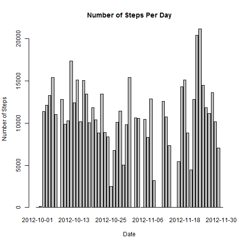
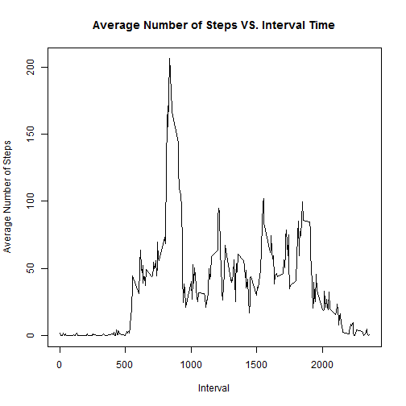
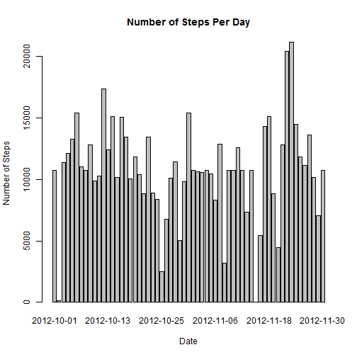

The given project would be implemented in a number of steps such as -

1. Loading and Preprocessing the data.

2. Calculating the mean number of steps taken per day.

3. Calculating the average daily activity pattern.

4. Inputing the missing values

5. Calculating the differences between activity patterns between weekends and weekdays.

 Loading and Preprocessing the data
--------------------------------------

The code needed to load data is given as -


```r
raw_data <- read.csv("activity.csv")
print(head(raw_data))
```

```
##   steps       date interval
## 1    NA 2012-10-01        0
## 2    NA 2012-10-01        5
## 3    NA 2012-10-01       10
## 4    NA 2012-10-01       15
## 5    NA 2012-10-01       20
## 6    NA 2012-10-01       25
```

```r
print(colnames(raw_data))
```

```
## [1] "steps"    "date"     "interval"
```

Calculating the number of Steps taken per day -
----------------------------------------------------


```r
# Sum of Steps across different dates
steps_dates <- aggregate(raw_data$steps,list(raw_data$date),sum, na.rm = TRUE)
average_steps_dates <- aggregate(raw_data$steps,list(raw_data$date),sum, na.rm = TRUE)
colnames(steps_dates) <- c('dates','number_steps')
```

###Plotting the histogram-


```r
# plotting histogram
barplot(steps_dates$number_steps, names.arg = steps_dates$date, main = 'Number of Steps Per Day', xlab = 'Date', ylab = 'Number of Steps')
```

 

### Mean and Meadian of the number of steps taken per day
The mean and median of the number of steps taken per day is given as -


```r
# Average number and median of steps taken per day
median <- median(steps_dates$number_steps, na.rm = TRUE)
mean <- mean(steps_dates$number_steps, na.rm = TRUE)
```

Calculating the average daily activity pattern
---------------------------------------------------

The average daily pattern value of the number of steps taken in a given interval is given as -


```r
# Average Daily Activity Plan
average_steps_interval <- aggregate(raw_data$steps, list(raw_data$interval), mean, na.rm = TRUE)
colnames(average_steps_interval) <- c('interval', 'step_number')
plot(average_steps_interval$interval, average_steps_interval$step_number ,type = 'l', xlab = 'Interval',ylab = 'Average Number of Steps', main = 'Average Number of Steps VS. Interval Time') 
```

 

The maximum number of steps taken in a given interval is given as -


```r
#Maximum Number of Steps in the interval
max_steps_index <- which.max(average_steps_interval$step_number)
max_interval <- average_steps_interval$interval[max_steps_index]
```

Imputing NA (missing) values
-----------------------------------

The number of rows with NA (missing values) is given as - 


```r
#Number of rows with NA values
number_of_rows <- sum(!complete.cases(raw_data))
```

Further improving the given data, we have -

```r
# Substituting the number of steps columns with NA values with average number of steps for the given interval
new_activity <- merge(raw_data,average_steps_interval, by = 'interval' ) 
na_values <- is.na(new_activity$steps)
new_activity$steps[na_values] <- new_activity$step_number[na_values]
new_activity <- new_activity[,c(1:3)]
head(new_activity)
```

```
##   interval    steps       date
## 1        0 1.716981 2012-10-01
## 2        0 0.000000 2012-11-23
## 3        0 0.000000 2012-10-28
## 4        0 0.000000 2012-11-06
## 5        0 0.000000 2012-11-24
## 6        0 0.000000 2012-11-15
```

```r
tail(new_activity)
```

```
##       interval    steps       date
## 17563     2355 0.000000 2012-10-16
## 17564     2355 0.000000 2012-10-07
## 17565     2355 0.000000 2012-10-25
## 17566     2355 0.000000 2012-11-03
## 17567     2355 1.075472 2012-10-08
## 17568     2355 1.075472 2012-11-30
```


```r
## Plotting the histogram

# Sum of Steps across different dates
steps_dates <- aggregate(new_activity$steps,list(new_activity$date),sum, na.rm = TRUE)
average_steps_dates <- aggregate(new_activity$steps,list(new_activity$date),sum, na.rm = TRUE)
colnames(steps_dates) <- c('dates','number_steps')

barplot(steps_dates$number_steps, names.arg = steps_dates$date, main = 'Number of Steps Per Day', xlab = 'Date', ylab = 'Number of Steps')
```

 

Differences in Activity Patterns between Weekdays and Weekends


```r
# Difference between weekdays and weekends 
library(lattice)
new_activity$date <- as.Date(new_activity$date,format = '%Y-%m-%d')
new_activity$day <- ifelse(weekdays(new_activity$date) %in% c('Saturday','Sunday'), 'weekend', 'weekday')
head(new_activity)
```

```
##   interval    steps       date     day
## 1        0 1.716981 2012-10-01 weekday
## 2        0 0.000000 2012-11-23 weekday
## 3        0 0.000000 2012-10-28 weekend
## 4        0 0.000000 2012-11-06 weekday
## 5        0 0.000000 2012-11-24 weekend
## 6        0 0.000000 2012-11-15 weekday
```


